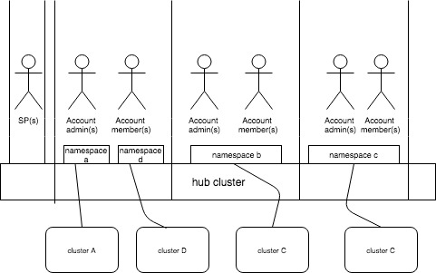

# Multi tenancy use case :

- multiple tenants (accounts) will be sharing an instance of multi-cluster hub (aka cluster). This requires proper isolation between account resources, or resources restricted only to super user access (cluster admin).

- The system is secure in such that no account user can access another account’s resources and/or configuration. When a user logs in, he/she is authenticated in the context of a specific account and all activity is performed within the context of this account.

- switching between multiple accounts needs to be supported ( targeted for future)

- Role based access control should be enabled for all resources ( cluster, Application, policies) for operational efficiceny Note: MCM provides access control at the namespace level. Role based access to namespaces is granted to teams, and Teams are defined within Accounts.

- Account rules and enforcement of account rules

# Terminology and key notes
## Account:
same as tenant
Account can be associated to an OIDC provider

## Account Admin
role to manage an account
can create new team
can create namespace
can create policies for the account that the user is administering

## Service Provider (SP)
SP is a Cluster Administrator on the MCM Hub
SP onboards Identity provider/LDAP(s)
SP manages account - create, delete, suspend etc
SP can add users to account as "PRIMARY_OWNER" or a "MEMBER"
SP can create account rules : Quatas- number of clusters, applications, cluster security policy etc

