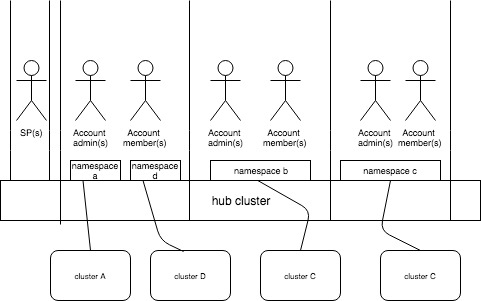

<!-- START doctoc generated TOC please keep comment here to allow auto update -->
<!-- DON'T EDIT THIS SECTION, INSTEAD RE-RUN doctoc TO UPDATE -->
**Table of Contents**  *generated with [DocToc](https://github.com/thlorenz/doctoc)*

- [Multi tenancy use case](#multi-tenancy-use-case)
- [Terminology and key notes](#terminology-and-key-notes)
  - [Account:](#account)
  - [Account Admin](#account-admin)
  - [Service Provider (SP)](#service-provider-sp)
- [Use cases](#use-cases)
  - [MSP Users (Cluster Admin role)](#msp-users-cluster-admin-role)
      - [Tenant Users](#tenant-users)

<!-- END doctoc generated TOC please keep comment here to allow auto update -->

# Multi tenancy use case

- multiple tenants (accounts) will be sharing an instance of multi-cluster hub (aka cluster). This requires proper isolation between account resources, or resources restricted only to super user access (cluster admin).

- The system is secure in such that no account user can access another account’s resources and/or configuration. When a user logs in, he/she is authenticated in the context of a specific account and all activity is performed within the context of this account.

- switching between multiple accounts needs to be supported ( targeted for future)

- Role based access control should be enabled for all resources ( cluster, Application, policies) for operational efficiceny Note: MCM provides access control at the namespace level. Role based access to namespaces is granted to teams, and Teams are defined within Accounts.

- Account rules and enforcement of account rules

# Terminology and key notes
## Account:
same as tenant
Account can be associated to an OIDC provider

## Account Admin
role to manage an account
can create new team
can create namespace
can create policies for the account that the user is administering

## Service Provider (SP)
SP is a Cluster Administrator on the MCM Hub
SP onboards Identity provider/LDAP(s)
SP manages account - create, delete, suspend etc
SP can add users to account as "PRIMARY_OWNER" or a "MEMBER"
SP can create account rules : Quatas- number of clusters, applications, cluster security policy etc

# Use cases
## MSP Users (Cluster Admin role)
- Create, update membership in, and delete accounts, i.e. tenant on-boarding and management
  - Requires a common "Tenant" model between MCM and CEM/ICAM
- View a list of all Accounts in one view
- Do chargeback/billing based on each Account (metering/usage etc. metrics per tenant)
- Assign roles to users within an Account (AccountAdmin or member). These roles define if the user can create namespaces/teams.
- View and alter any cluster resource (cluster admin role has full control)
- Be able to create accoiunt quotas

#### Tenant Users
- only access resources related to his Account and Team(s) in the Search view
- If Tenant user has AccountAdmin role:
  - can add additional users/groups to the Account
  - can create and manage Teams
  - can create namespaces
